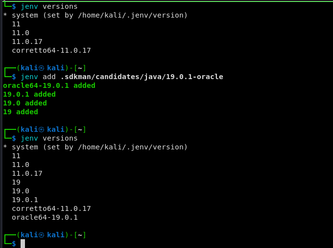

# switch differents versions of java in kali linux

## know how java sdk
```bash
## know how java versions switch
## know how switch java version
## know how version switch java
```

[Video for installation](https://www.youtube.com/watch?v=uag_JeVg15s&ab_channel=V%C3%ADctorOrozco)

## know how dkman install

```bash
curl -s "https://get.sdkman.io" | bash
source "$HOME/.sdkman/bin/sdkman-init.sh"
sdk version
```

## know how jenv install

```bash
git clone https://github.com/jenv/jenv.git ~/.jenv
# Shell: bash
echo 'export PATH="$HOME/.jenv/bin:$PATH"' >> ~/.bash_profile
echo 'eval "$(jenv init -)"' >> ~/.bash_profile
# Shell: zsh
echo 'export PATH="$HOME/.jenv/bin:$PATH"' >> ~/.zshrc
echo 'eval "$(jenv init -)"' >> ~/.zshrc

exec $SHELL -l
```

## workin switch java

```bash
java -version

sdk list java

## for install 

## for update java
sdk install java 19.0.1-oracle 
## for ysoserial
sdk install java 11.0.17-amzn
```


## know how java versions in my system

```bash
## not run in kali or need install
eix opendjk
```

## know how java jenv versions for differents java versions

```bash
jenv versions

## view candidates for use . Since home we can do
ls .sdkman/candidates/java/
```


```bash
## add to jenv

jenv add .sdkman/candidates/java/your_version

```



## know how java change java version only in the current shell

```bash
jenv shell 19.0.1

or

jenv shell 11

```
!! important only works for me in bash terminal!!! not run in zsh

## know how java stablish java version for dir

```bash
jenv local 11
```


